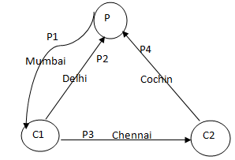
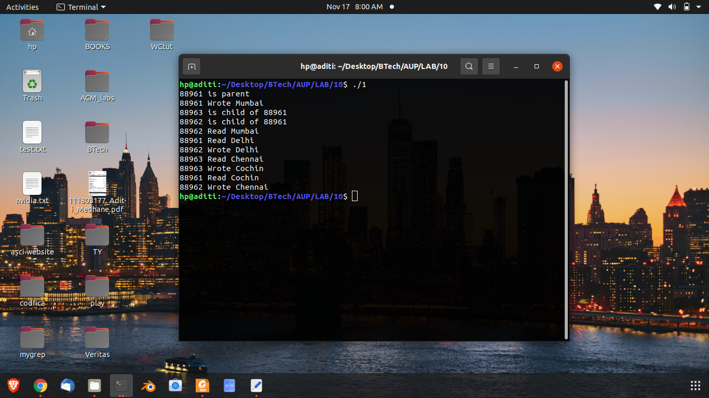
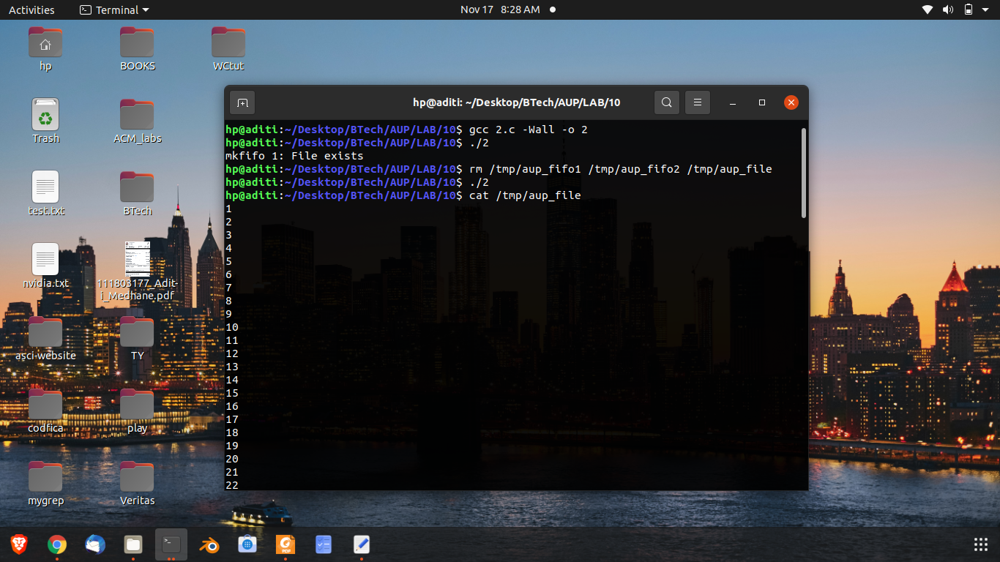
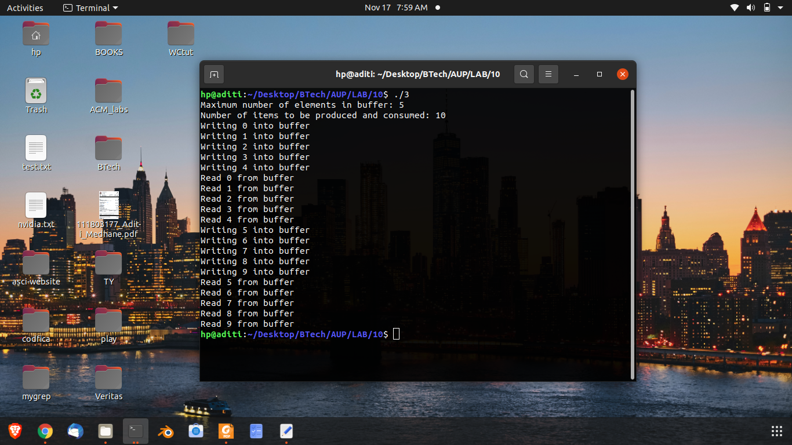

## Q1
A pipe setup is given below that involves three processes. 
P is the parent process, and C1 and C2 are child processes, spawned from P. 
The pipes are named p1, p2, p3, and p4. Write a program that establishes the necessary pipe connections, 
setups, and carries out the reading/writing of the text in the indicated directions.



## Code

\small
```{.c .numberLines startFrom="1"}
#include <sys/types.h>
#include <fcntl.h>
#include <unistd.h>
#include <errno.h>
#include <stdio.h>
#include <string.h>

#define M1 "Mumbai"
#define M2 "Delhi"
#define M3 "Chennai"
#define M4 "Cochin"

#define BUFLEN 10

int main(void) {

		int pid, ppid;

		int pipes[5][2];

		int n;
		char buf[BUFLEN];

		int i;

		/* open 4 pipes */
		for (i = 1; i <= 4; i++) {
				if (pipe(pipes[i]) == -1) {
						perror("pipe");
						return errno;
				}
		}

		if ((pid = fork()) == -1) {
				perror("fork 1 failed");
				return errno;
		}
		else if (!pid) {
				/* C1 */

				/* 1 W */
				close(pipes[1][1]);

				/* 2 R */
				close(pipes[2][0]);

				/* 3 R */
				close(pipes[3][0]);

				/* 4 RW */
				close(pipes[4][0]);
				close(pipes[4][1]);

				pid = getpid();
				ppid = getppid();

				printf("%d is child of %d\n", pid, ppid);

				if ((n = read(pipes[1][0], buf, BUFLEN)) == -1) {
						perror("read 1");
						return errno;
				}
				printf("%d Read %s\n", pid, buf);
				close(pipes[1][0]);

				if (write(pipes[2][1], M2, strlen(M2) + 1) == -1) {
						perror("write 2");
						return errno;
				}
				printf("%d Wrote %s\n", pid, M2);
				close(pipes[2][1]);

				if (write(pipes[3][1], M3, strlen(M3) + 1) == -1) {
						perror("write 3");
						return errno;
				}
				printf("%d Wrote %s\n", pid, M3);
				close(pipes[3][1]);

				return 0;
		}

		if ((pid = fork()) == -1) {
				perror("fork 2 failed");
				return errno;
		}
		else if (!pid) {
				/* C2 */

				/* 1 RW */
				close(pipes[1][0]);
				close(pipes[1][1]);

				/* 2 RW */
				close(pipes[2][0]);
				close(pipes[2][1]);

				/* 3 W */
				close(pipes[3][1]);

				/* 4 R */
				close(pipes[4][0]);

				pid = getpid();
				ppid = getppid();
				printf("%d is child of %d\n", pid, ppid);

				if ((n = read(pipes[3][0], buf, BUFLEN)) == -1) {
						perror("read 3");
						return errno;
				}
				printf("%d Read %s\n", pid, buf);
				close(pipes[3][0]);

				if (write(pipes[4][1], M4, strlen(M4) + 1) == -1) {
						perror("write 4");
						return errno;
				}
				printf("%d Wrote %s\n", pid, M4);
				close(pipes[4][1]);

				return 0;
		}

		/* P */

		/* close read end of 1 */
		close(pipes[1][0]); 

		/* close write end of 2 */
		close(pipes[2][1]);

		/* close write end of 4 */
		close(pipes[4][1]);

		/* close both ends of 3 */
		close(pipes[3][0]);
		close(pipes[3][1]);

		pid = getpid();
		printf("%d is parent\n", pid);


		if (write(pipes[1][1], M1, strlen(M1) + 1) == -1) {
				perror("write 1");
				return errno;
		}
		printf("%d Wrote %s\n", pid, M1);
		close(pipes[1][1]);

		if ((n = read(pipes[2][0], buf, BUFLEN)) == -1) {
				perror("read 2");
				return errno;
		}
		printf("%d Read %s\n", pid, buf);
		close(pipes[2][0]);

		if ((n = read(pipes[4][0], buf, BUFLEN)) == -1) {
				perror("read 4");
				return errno;
		}
		printf("%d Read %s\n", pid, buf);
		close(pipes[4][0]);
		
		return 0;
}


```
### Output




\pagebreak

## Q2
Let P1 and P2 be two processes alternatively writing numbers from 1 to 100 to a file. Let P1 write odd
numbers and p2, even. Implement the synchronization between the processes using FIFO.

## Code

\small
```{.c .numberLines startFrom="1"}
#include <sys/types.h>
#include <sys/stat.h>
#include <unistd.h>
#include <fcntl.h>
#include <stdio.h>
#include <errno.h>
#include <string.h>


#define FIFO1 "/tmp/aup_fifo1"
#define FIFO2 "/tmp/aup_fifo2"
#define FILENAME "/tmp/aup_file"
#define BUFLEN 10

int main(void) {

		int pid;
		int fr, fw, fp;
		int i;
		char buf[BUFLEN];

		if (mkfifo(FIFO1, S_IRUSR | S_IWUSR) == -1) {
				perror("mkfifo 1");
				return errno;
		}

		if (mkfifo(FIFO2, S_IRUSR | S_IWUSR) == -1) {
				perror("mkfifo 2");
				return errno;
		}

		if ((fp = open(FILENAME, O_WRONLY | O_CREAT,
					   S_IRUSR | S_IWUSR)) == -1) {
				perror("file");
				return errno;
		}

		if ((pid = fork()) == -1) {
				perror("fork");
				return errno;
		}
		else if (pid) {
				/* P1 */

				if ((fw = open(FIFO1, O_WRONLY)) == -1) {
						perror("write 1");
						return errno;
				}

				if ((fr = open(FIFO2, O_RDONLY)) == -1) {
						perror("read 2");
						return errno;
				}

				i = 1;
				while (i <= 100) {
						sprintf(buf, "%d\n", i);

						if (write(fp, buf, strlen(buf)) == -1) {
								perror("odd write");
								return errno;
						}

						if (write(fw, "*", 1) == -1) {
								perror("sync write odd");
								return errno;
						}

						if (read(fr, buf, 1) == -1) {
								perror("sync read odd");
								return errno;
						}

						i += 2;
				}

				close(fp);
				close(fw);
				close(fr);

				return 0;
		}
		else {
				/* P1 */

				if ((fr = open(FIFO1, O_RDONLY)) == -1) {
						perror("read 1");
						return errno;
				}

				if ((fw = open(FIFO2, O_WRONLY)) == -1) {
						perror("write 2");
						return errno;
				}

				i = 2;
				while (i <= 100) {
						if (read(fr, buf, 1) == -1) {
								perror("sync read even");
								return errno;
						}

						sprintf(buf, "%d\n", i);

						if (write(fp, buf, strlen(buf)) == -1) {
								perror("odd write");
								return errno;
						}

						if (write(fw, "*", 1) == -1) {
								perror("sync write even");
								return errno;
						}
						
						i += 2;
				}

				close(fp);
				close(fw);
				close(fr);

				return 0;
		}
}

```
## Explanation
The program uses two FIFOs, **/tmp/aup_fifo1** and **/tmp/aup_fifo2**. 
The file which is used for writing the numbers is **/tmp/aup_file**.

### Output




\pagebreak

## Q3
Implement a producer-consumer setup using shared memory and semaphore. Ensure that data doesn’t get
over-written by the producer before the consumer reads and displays on the screen. Also ensure that the
consumer doesn’t read the same data twice.

## Code

\small
```{.c .numberLines startFrom="1"}
#include <sys/types.h>
#include <unistd.h>
#include <sys/mman.h>
#include <sys/stat.h>
#include <fcntl.h>
#include <semaphore.h>
#include <errno.h>
#include <stdio.h>

#define BUF_SIZE 5
#define N_ITEMS 10

int main(void) {

		int *buf;
		sem_t *sem_fill;
		sem_t *sem_empty;
		int pid;
		int i;

		printf("Maximum number of elements in buffer: %d\n", BUF_SIZE);
		printf("Number of items to be produced and consumed: %d\n", N_ITEMS);

		if ((buf = (int *)mmap(NULL,
						BUF_SIZE * sizeof(int),
						PROT_READ | PROT_WRITE,
						MAP_SHARED | MAP_ANONYMOUS,
						-1,
						0)) == (void *)-1) {
				perror("mmap 1");
				return errno;
		}

		if ((sem_fill = (sem_t *)mmap(NULL,
						sizeof(sem_t),
						PROT_READ | PROT_WRITE,
						MAP_SHARED | MAP_ANONYMOUS,
						-1,
						0)) == (void *)-1) {
				perror("mmap fill");
				return errno;
		}

		if (sem_init(sem_fill, 1, 0) == -1) {
				perror("init fill");
				return errno;
		}

		if ((sem_empty = (sem_t *)mmap(NULL,
						sizeof(sem_t),
						PROT_READ | PROT_WRITE,
						MAP_SHARED | MAP_ANONYMOUS,
						-1,
						0)) == (void *)-1) {
				perror("mmap 2");
				return errno;
		}

		if (sem_init(sem_empty, 1, BUF_SIZE) == -1) {
				perror("init empty");
				return errno;
		}

		if ((pid = fork()) == -1) {
				perror("fork");
				return errno;
		}
		else if (pid) {
				/* parent, producer */
				
				for (i = 0; i < N_ITEMS; i++) {
						if (sem_wait(sem_empty) == -1) {
								perror("wait in producer");
								return errno;
						}

						buf[i % BUF_SIZE] = i;
						printf("Writing %d into buffer\n", i);

						if (sem_post(sem_fill) == -1) {
								perror("post in producer");
								return errno;
						}
				}
		}
		else {
				/* child, consumer */

				for (i = 0; i < N_ITEMS; i++) {

						if (sem_wait(sem_fill) == -1) {
								perror("wait in consumer");
								return errno;
						}

						printf("Read %d from buffer\n", buf[i % BUF_SIZE]);

						if (sem_post(sem_empty) == -1) {
								perror("post in consumer");
										return errno;
						}
				}
		}

		return 0;
}

```
## Explanation
There is 1 producer and 1 consumer, 10 items are sent through the shared memory in total, capacity of the
shared memory is 5 items.
### Output




\pagebreak
