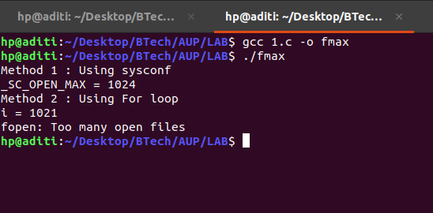
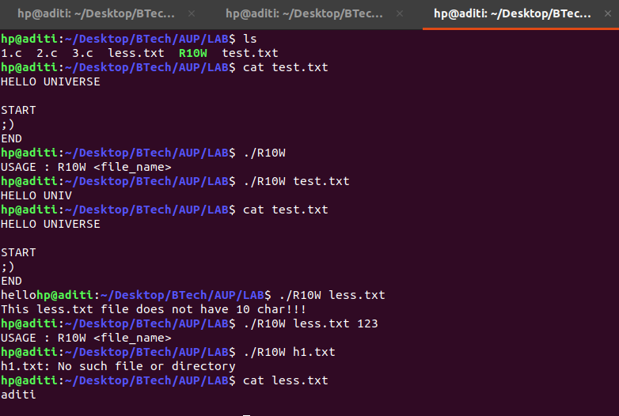
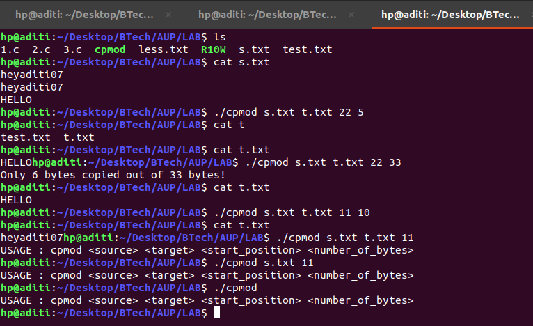

### 1. There are the two ways to find the maximum number of files that a process can have open at any time. Write a small program to print the values obtained using these methods.

```{.c}

#include <stdio.h>
#include <unistd.h>
#include <errno.h>
#include <stdlib.h>

int main () {
    long result;
    errno = 0;

    printf("Method 1 : Using sysconf \n");
    if ((result = sysconf (_SC_OPEN_MAX)) == -1)
        if (errno == 0)
        puts ("OPEN_MAX is not supported.");
        else perror ("sysconf () error");
    else 
        printf("_SC_OPEN_MAX = %ld\n", result);
    

    printf("Method 2 : Using For loop \n");
    int i;
    for (i = 0; i < 10000; ++i){
        if (!fopen("/dev/null", "r")) {
            printf("i = %d\n", i);
            perror("fopen"); 
            exit(1);
        }
    }
    return 0;
}


```


### RESULT 




### 2. Assume that you have to read 10 characters from the beginning of an existing file and then to write “hello” to the end of the file. Write a program to achieve this only using read and write functions. Do not use lseek function.

```{.c}

#include <stdio.h>
#include <string.h>
#include <unistd.h>
#include <fcntl.h>
#include <errno.h>

#define BUF_SIZE 512
#define READ_CHARS 10

int main(int argc, char*argv[]){

	//Case : If command line input is incorrect 
	if (argc != 2) {
		fprintf(stderr,"USAGE : R10W <file_name>\n");
		return EINVAL;
	}

	int fd, count;
	char buff_small[READ_CHARS + 1];

	//Case : open file in Read & write mode failed
	if ((fd = open(argv[1], O_RDWR)) == -1) {
		perror(argv[1]);
		return errno;
	}

	//Now read first 10 char from the file
	if (read(fd, buff_small, READ_CHARS) != READ_CHARS) {
		fprintf(stderr, "This %s file does not have %d char!!!\n", argv[1], READ_CHARS);
		return EINVAL;
	}

	buff_small[READ_CHARS] = '\n';

	//Now write this first 10 characters (which are read using "read()" to stdout)
	if ((count = write(0, buff_small, READ_CHARS + 1)) != READ_CHARS + 1) {
		
		//Write syscall failed!
		if (count == -1) {
			perror(argv[1]);
			return errno;
		}
		else {
			fprintf(stderr, "Unable to write %d characters to STDOUT\n", READ_CHARS + 1);
			return EINVAL;
		}
	}

	//Close file from R&W mode
	close(fd);

	//Open file again in write only +  append mode

	//Case : open failed
	if ((fd = open(argv[1], O_WRONLY | O_APPEND)) == -1) {
		perror(argv[1]);
		return errno;
	}

	//Store our target string(which needs to be written) in a small buffer 
	strcpy(buff_small, "hello");

	if ((count = write(fd, buff_small, strlen(buff_small))) != strlen(buff_small)) {

		if (count == -1){
			perror(argv[1]);
			return errno;
		}
		else {
			fprintf(stderr, "Unable tp write %s at the EOF of %s\n", buff_small, argv[1]);
			return EINVAL;
		}

	}

	return 0;	
}


```


### RESULT 




### 3. Write a program to create a function cp_modified(source_filename, target_filename, start_position, number_of_bytes),  which copies the number_of_bytes of contents of input file source_filename from the start_position to the target_filename.

```{.c}

#include <stdio.h>
#include <string.h>
#include <unistd.h>
#include <fcntl.h>
#include <errno.h>

#include <stdlib.h>
#include <sys/types.h>

#define MIN(a, b) ( (a) < (b) ? (a) : (b))
#define BUFFER_SIZE 1024
#define READ_CHARS 10

/*    
 *  cp_modified
 *  param[1] - source filename,
 *  param[2] - target filename,
 *  param[3] - start position,
 *  param[4] - number of bytes to be copied from source to target
 *  return value -  number of bytes written successfully to the target file
 */

int cp_modified(char *source_filename,
                char *target_filename,
                int start_position,
                int number_of_bytes) {
        
        //fs : file descriptor for source file
        //ft : file descriptor for target file
        int fs, ft;
        int count, return_value;

        int total_count = 0;
        char buffer[BUFFER_SIZE];

        //if source_file open failed -> return -1 & end of discussion!
        if ((fs = open(source_filename, O_RDONLY)) == -1) {
            //printf("fs : %d\n", fs);
            return_value = fs;
            return return_value;
        }

        //if target_file open failed -> close source_file.
        if ((ft = open(target_filename, O_CREAT | O_WRONLY | O_TRUNC , 0777)) == -1) {
            return_value = -1;
            close(fs);
        }

        if ((return_value = lseek(fs, start_position, SEEK_SET)) == -1){
            close(ft);
        }

        while((count = read(fs, 
			    buffer, 
			    MIN(number_of_bytes - total_count, BUFFER_SIZE))) == BUFFER_SIZE) {
            if ((return_value = write(ft, buffer, count)) == -1)
                close(ft);
            total_count += count;
        }

        //CASE : Nothing wriiten on target file afer "write"!
        if (count == -1){
            close(ft);
        }

        if ((return_value = write(ft, buffer, count)) != count){
            if(return_value == -1){
                close(ft);
            }
        }

        close(fs);
        close(ft);

        total_count += return_value;

        return total_count;
}

int main(int argc, char *argv[]){
    if (argc != 5) {
        fprintf(stderr, "USAGE : cpmod <source> <target> <start_position> <number_of_bytes>\n");
        return EINVAL;
    }

    int start, number_of_bytes;
    start = atoi(argv[3]);
    number_of_bytes = atoi(argv[4]);

    int return_cp;
    if ((return_cp = cp_modified(argv[1], argv[2], start, number_of_bytes)) != number_of_bytes) {
        if (return_cp == -1) {
            fprintf(stderr, "%s, %s", argv[1], argv[2]);
            perror("");
            return errno;
        }
        else {
            fprintf(stderr, "Only %d bytes copied out of %d bytes!\n", return_cp, number_of_bytes);
            return 1;
        }
    }

    return 0;
}

```

### RESULT 


