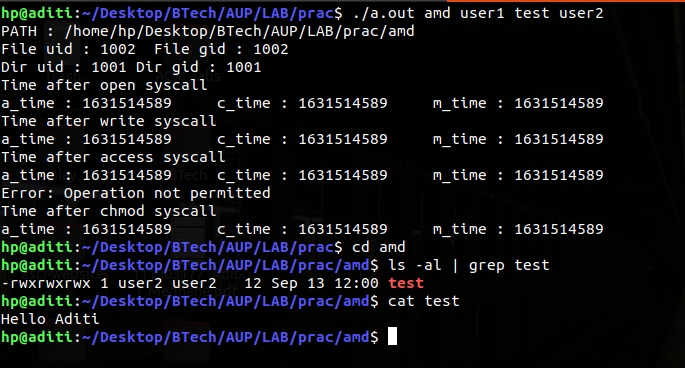
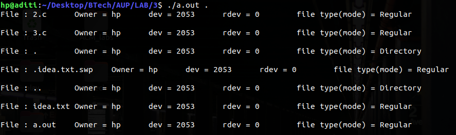

## Q1

Implement the program for the command:  ./prog1 < foo.txt > bar.txt 2> bar1.txt.

## Code

\small
```{.c .numberLines startFrom="1"}
#include <stdio.h>
#include <stdlib.h>
#include <pwd.h>
#include <sys/types.h>
#include <sys/stat.h>
#include <unistd.h>
#include <fcntl.h>          
#include <errno.h>
#include <dirent.h>

//argv  1 - foo.txt
// 	2 - bar.txt
// 	3 - bar1.txt

// ./prog1 < foo.txt > bar.txt 2>bar1.txt
//Meaning I undestand
// take input from foo.txt to prog1
// redirect content of foo.txt to bar.txt 
// 	if successfull content of foo.txt will get copied into bar.txt
// 	else error will be redirected to file bar1.txt as "2" represents "stderr"
int main(int argc, char* argv[]){
	int fd1, fd2, fd3;
	fd1 = open(argv[1], O_RDWR| O_CREAT, 0777);
	fd2 = open(argv[2], O_RDWR | O_CREAT| O_APPEND, 0777);
	fd3 = open(argv[3], O_RDWR | O_CREAT| O_APPEND, 0777);

	//Take input from foo.txt into ./prog1 via STDIN
	//dup2(fd1, 0);
	close(0);
	dup(fd1);
//	close(fd1);

//	fd1 = open(argv[1], O_RDWR| O_CREAT, 0777);
	//Redirect content of foo.txt to bar.txt
	if(dup2(fd2, fd1) == -1){
		//redirect STDERR i.e. "2" to bar1.txt if above statement fails 
		dup2(fd3, 2);
	}

	close(fd1);
	close(fd2);
	close(fd3);

	return 0;
}


```

\pagebreak

## Q2

> Create a directory with uid and gid as user1 and write permission to “others”.
> Create a new file in this directory by uid and gid as user2.
> Write a program which invokes functions: open, write, access and chmod on this file by user2.
> Print the uid and gid of the file and the directory. 
> Also print all the time values of this file and the parent directory after each function call.
> Write details about your observation.


## Code

\small
```{.c .numberLines startFrom="1"}

#include <stdio.h>
#include <stdlib.h>
#include <pwd.h>
#include <sys/types.h>
#include <sys/stat.h>
#include <unistd.h>
#include <fcntl.h>           
#include <errno.h>
#include <dirent.h>
#include <string.h>

void time(struct stat buf, char* syscall){
	printf("Time after %s syscall \n", syscall);
	printf("a_time : %ld\t", buf.st_atime);
	printf("c_time : %ld\t", buf.st_ctime);
	printf("m_time : %ld\n", buf.st_mtime);
}

int main(int argc, char* argv[]){
	int md;
	//Create dir
	md = mkdir(argv[1], 0777);
	
	//Get path
	char* PATH;
	//char* PATH2;
	long max;
	max = pathconf("/", _PC_PATH_MAX);
	PATH = (char*)malloc(max);
	//PATH2 = (char*)malloc(max);
	getcwd(PATH, max);
	strcat(PATH, "/");
	strcat(PATH, argv[1]);
	if( chdir(PATH) == 0);
		printf("PATH : %s\n", PATH);
 
 	//getcwd(PATH2, max);
	//printf("After cat : %s\n",PATH2);


	//now change ownership to user1  - chown
        int set_u = atoi(argv[2]);	
	struct stat statv1;
	if(stat(argv[1], &statv1) < 0)
		perror("stat error");
	chown(PATH, set_u, statv1.st_uid);
	

	//now change mode o+w others write - chmod
	if(chmod(PATH, S_IWOTH) < 0){	
	perror("chmod error");
		exit(1);
	}
	
	//create a file inside that directory
	int fd;
	fd = mknod(argv[3], S_IFREG,0);
	if(fd == 0)
		printf("File created successfully\n");

	//print uid & gid of file & dir
	//argv[3] -> filename
	struct stat buf;
	if(stat(argv[3], &buf) < 0)
		perror("stat error");

	//change owner to user2
        int setuf = atoi(argv[4]);
        chown(PATH, setuf,buf.st_uid);

	printf("File uid : %d\t File gid : %d\n", buf.st_uid, buf.st_gid);
	printf("Dir uid : %d\t Dir gid : %d\n",statv1.st_uid, statv1.st_gid);
	
	//open file/
	fd = open(argv[3], O_RDWR | O_CREAT);
	if(fd == -1)
		perror("Open fail");
	time(buf, "open");
	
	//write into file 
	int size = write(fd, "Hello Aditi\n", strlen("Hello Aditi\n"));
	time(buf, "write");
	
	//access file
	int acc = access(argv[3], F_OK);
	if(acc == -1)
		perror("Error:");
	time(buf, "access");
	
	//chmod file
	char mode[] = "0777";
	int i;
	i = strtol(mode, 0, 8);
	if(chmod (PATH, i) < 0)
		perror("Error");
	
	time(buf, "chmod");

	return 0;
}

```
\normalsize

## Explanation
- Access time of file is updated when file is opened for reading the contents of file.
- Change time of file is updated when file is executing chown & chmod functionalities.
- Modification time is updated when file is opened for writing contents into the file. 

## Output



\pagebreak

## Q3
> Write a program that prints the owner, dev, rdev and file type of files.
> By inputting a directory, the program should read the directory and print the above information for all files in the directory.

## Code

\small
```{.c .numberLines startFrom="1"}
#include <stdio.h>
#include <stdlib.h>
#include <pwd.h>
#include <sys/types.h>
#include <sys/stat.h>
#include <unistd.h>
#include <fcntl.h>           
#include <errno.h>
#include <dirent.h>

int main(int argc, char* argv[]){
	int i;
	struct stat buf;

	struct dirent *direntp;
	DIR *dirp;

	dirp = opendir(argv[1]);

	while((direntp = readdir(dirp)) != NULL){
		printf("File : %s\t", direntp->d_name);

			perror("stat error");
		}

		struct passwd *pw = getpwuid(buf.st_uid);
		if(pw != 0)
			printf("Owner = %s\t", pw->pw_name);

		printf("dev = %ld\t", buf.st_dev);
		printf("rdev = %ld\t", buf.st_rdev);
	
		//Check all modes & add switch case
		if ((buf.st_mode & S_IFMT) == S_IFREG) {
        	       printf("file type(mode) = Regular\n\n");
	        }	
		if ((buf.st_mode & S_IFMT) ==  S_IFDIR) {
                       printf("file type(mode) = Directory\n\n");
                }  
		if ((buf.st_mode & S_IFMT) == S_IFLNK) {
                       printf("file type(mode) = Symbolic Link\n\n");
                }


	}
	closedir(dirp);
	return 0;
}

```
\normalsize

## Explanation

- 1) owner name - To get owner name,need to access it from passwd file, using "getpwuid" by providing st_uid from struct stat of respective file in the directory.
- 2)dev - field st_dev from struct stat
- 3) rdev - field st_rdev from struct stat 
- 4) file type - with the help of field st_mode, can identify file type.
- 5) To get above information for all files, basically need to travesrse through all files including "." & "..".

## Output




