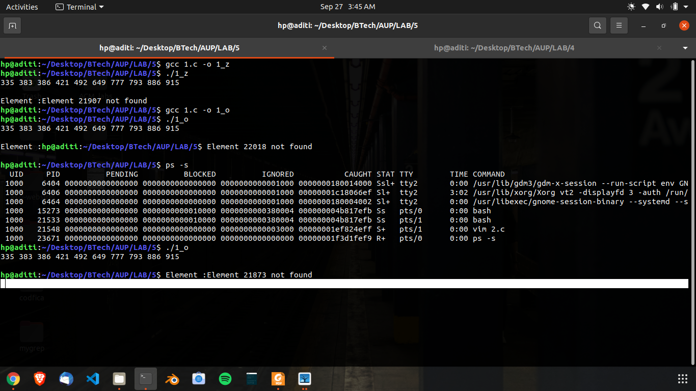
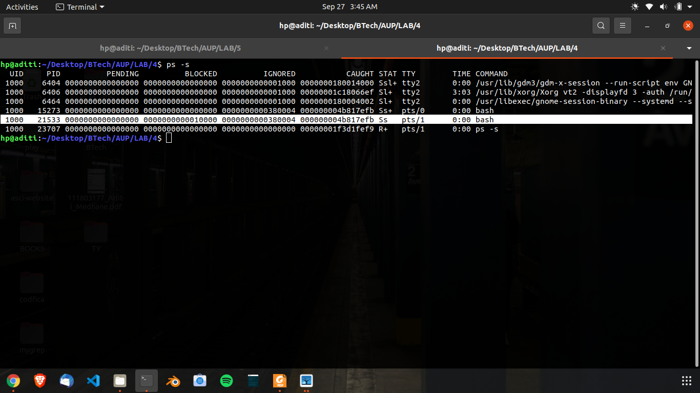
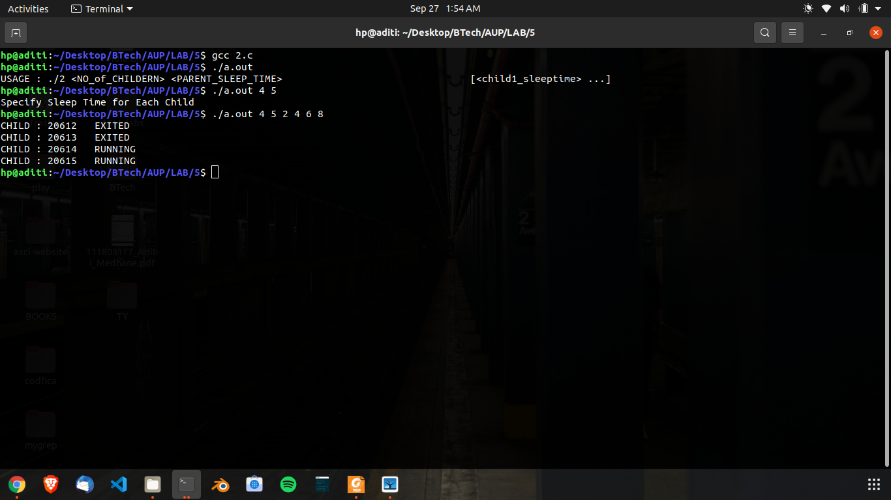
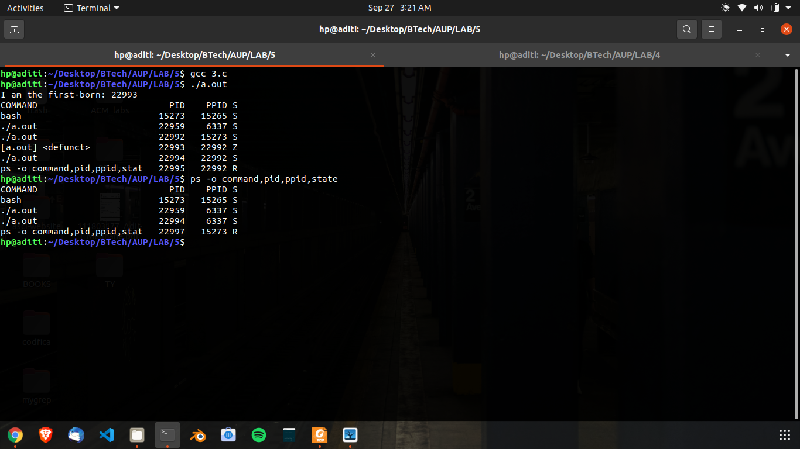

## Q1
>Implement a program in which parent sorts an integer array. 
>Then it creates a child process. The child accepts a number to be searched in the array, 
>performs a binary search in the array and display the result. 
>Appropriately modify the program to create scenarios to demonstrate that zombie and orphan states of the child can be formed.

## Code

\small
```{.c .numberLines startFrom="1"}
#include <stdio.h> //fflush defined
#include <stdlib.h>
#include <pwd.h>
#include <sys/types.h>
#include <sys/stat.h>
#include <unistd.h>
#include <fcntl.h>
#include <errno.h>
#include <dirent.h>

#include <string.h> //for memcpy
#define BUF_SIZE 100
#define N 10
#define MOD 1000

#define ZOMBIE 1
#define ORPHAN 2

static int buf[BUF_SIZE];
static int arr[BUF_SIZE];

//Generate Random Integer Array
void rand_arr(int *arr, int n, int limit){
	int i;
	for(i = 0; i < n; i++){
		arr[i] = rand() % limit;
	}
}

//Binary Search Algo
int binary_search(int *arr, int n, int x){
	int left, right, mid;
	int mid_element;

	left = 0;
	right = n-1;

	while(left <= right){
		mid = (left + right) / 2;
		mid_element = arr[mid];

		if(x < mid_element)
			right = mid + 1;
		else if(x > mid_element)
			left = mid + 1;
		else
			return mid;
	}
	return -1;
}

//MERGES a[left:mid], a[mid:right], using temp
void merge(int *a, int left, int right, int *buf){
	int mid;
	int size = left;
	int lp, rp;

	mid = (left + right) / 2;

	lp = left;
	rp = mid;

	while(lp < mid && rp < right){
		if(a[lp] <= a[rp]){
			buf[size++] = a[lp++];
		}
		else{
			buf[size++] = a[rp++];
		}
	}

	int start, end;
	if (lp == mid){
		start = rp;
		end = right;
	}
	else{
		start = lp;
		end = mid;
	}

	while(start < end){
		buf[size++] = a[start++];
	}

	memcpy(a + left, buf + left, sizeof(int) * (right - left));
}

void serial_MergeSort(int *a, int left, int right, int *buf){
	int mid = (left + right) / 2;
	
	//Already sorted
	if((right - left) <= 1)
		return;

	serial_MergeSort(a, left, mid, buf);
	serial_MergeSort(a, mid, right, buf);

	merge(a, left, right, buf);
}

void arr_print(int *arr, int n){
	int i;
	for(i = 0; i < n; i++)
		printf("%d ", arr[i]);
	printf("\n");
}

int main(int argc, char *argv[]){
	int elem, index;
	int n = N;

	rand_arr(arr, n, MOD);
	
	serial_MergeSort(arr, 0, n, buf);

	//PARENT
	if(fork()) {
#if SCENARIO == ZOMBIE
		sleep(10);
		exit(0);
#elif SCENARIO == ORPHAN
		exit(0);
#endif
	}
	//CHILD
	else{
		arr_print(arr, n);
		printf("\nElement :");

		//Usage of fflush : flush a stream
		//fflush()  forces  a  write  of  all user-space
		//buffered data for the given output or update stream via the  stream's
	      	// underlying write function.
		fflush(stdin);

		scanf("%d", &elem);
		index = binary_search(arr, n, elem);

		if(index >= 0){
			printf("Element %d found @ %d\n", elem, index);
		}
		else{
			printf("Element %d not found\n", elem);
		}
#if SCENARIO == ORPHAN
		printf("CHILD = %d\tPARENT = %d\n",getpid(), getppid());
#endif
	}

}
```

## Explanation
1. **Zombie process**: 
 - The parent is made to sleep for 10 second. Then, the child process accepts an
   input, searches it, displays the result, and exits.
 - When this happens, Ctrl+Z is used to stop the parent process, and *ps -s* is
   run. 
 - The output shows that the child process has zombied.

2. **Orphan process**:
 - The parent process is made to exit immediately without sleeping. Then the
   child process **tries to** access an input, searches, displays the result and
   leaves.
 - The child however **fails to execute scanf, and scanf returns -1, failing**.
   This is because when the parent exited, the child was adopted by *init*. Due
   to this it relenquishes control of *stdin*, causing scanf to fail.
 - The child then calls getppid(), and prints it's and the parent's PID. The
   ppid is **1**, which means the parent is *init*. This indicates that the
   child was *orphaned*.

## Output



\pagebreak

## Q2
> The parent starts as many child processes as to the value of its integer command
> line argument. The child processes simply sleep for the time specified by the
> argument, then exit. After starting all the children, the parent process does
> not wait for them immediately, but after a time specified by command line
> argument, checks the status of all terminated children, print the list of non
> terminated children and then terminates itself.

## Code

\small
```{.c .numberLines startFrom="1"}
#include <stdio.h> 
#include <stdlib.h>
#include <pwd.h>
#include <sys/types.h>
#include <sys/stat.h>
#include <unistd.h>
#include <fcntl.h>
#include <errno.h>
#include <dirent.h>

#include <sys/wait.h>

#define SIZE 100

static pid_t children[SIZE];
static int child_sleep_time[SIZE];

int main(int argc, char *argv[]){
	if(argc < 3){
		fprintf(stderr, "USAGE : ./2 <NO_of_CHILDERN> <PARENT_SLEEP_TIME>\
				[<child1_sleeptime> ...]\n");
		return EINVAL;
	}

	int n_child, n_parent_sleep;

	n_child = atoi(argv[1]);

	if(n_child > SIZE){
		fprintf(stderr, "Maximum number of Children is %d\n", SIZE);
		return EINVAL;
	}

	if(argc != (n_child + 3)){
		fprintf(stderr, "Specify Sleep Time for Each Child\n");
		return EINVAL;
	}

	n_parent_sleep = atoi(argv[2]);

	int i;
	int status;
	int pid_ret;

	for(i = 0; i < n_child; i++){
		child_sleep_time[i] = atoi(argv[3 + i]);
	}

	for(i = 0; i < n_child; i++){
		if ((children[i] = fork()) == -1){
			perror("fork");
			return errno;
		}
		else if (!children[i]){
			sleep(child_sleep_time[i]);
			exit(0);
		}
	}

	sleep(n_parent_sleep);

	for(i = 0; i < n_child; i++){
		printf("CHILD : %d\t", children[i]);
		//Child Process has not changed state, is still running
		if ((pid_ret = waitpid(children[i], &status, WNOHANG)) == 0){
			printf("RUNNING\n");
		}
		else if (pid_ret != -1){
			printf("EXITED\n");
		}
		else{
			printf("ERROR\n");
		}
	}
	return 0;

}
```
\normalsize

## Output




\pagebreak


## Q3
Write a program to create 2 child processes that ultimately become zombie
processes. The first child displays some message and immediately terminates. The
2nd child sleeps for 100 and then terminates. Inside the parent program using
“system” display the all the process stats and the program exits. Immediately on
the command prompt display the all the process stats. What happened to the
Zombie processes?

## Code

\small
```{.c .numberLines startFrom="1"}
#include <stdio.h>
#include <stdlib.h>
#include <sys/types.h>
#include <sys/stat.h>
#include <unistd.h>
#include <fcntl.h>
#include <errno.h>
#include <dirent.h>

void child_1_States(void){
	printf("I am the first-born: %d\n", getpid());
	exit(0);
}

void child_2_States(void){
	sleep(100);
	exit(0);s
}

int main(int argc, char*argv[]){
	int child_pid, i;

	void(*child_States[])(void) = {child_1_States, child_2_States};

	for(i = 0; i < 2; i++) {
		if ((child_pid = fork()) == -1) {
			perror("fork");
			return errno;
		}
		else if	(!child_pid){
			//IN CHILD
			child_States[i]();
			//WILL NEVER RETURN HERE ....LOL....
			//FUNCTION HAS exit() in it
		}
		
	}

	if(system("ps -o command,pid,ppid,state") == -1)
		perror("ps -o command, pid, ppid, state");

	return 0;
}
```
\normalsize
## Explanation
- It has not been specified that the parent should wait. If the parent does not
  sleep for more than 100 second, then the child which sleeps **will become
  orphan, not zombie**.
- The child which exits immediately is zombied. This can be seen by first
  calling *ps* using system *inside* the program, and immediately calling *ps*
  after the main program exists on the command prompt. 
- The first *ps* (in the program) shows that one of the process is Zombie(Z), and
  the other is Sleeping(S).
- The second *ps* shows that the other process is Sleeping(S), and it's parent
  is init, indicated by the ppid printed.

**What happens to the zombie process**? 

The child which exits is zombied. When the parent exits, it effectively becomes
like an **orphan** gets attached to *init*. Because it has terminated, it gets
**reaped** by init. 

On the other hand, the child which is sleeping gets
orphaned, as the parent exits before it.

## Output



