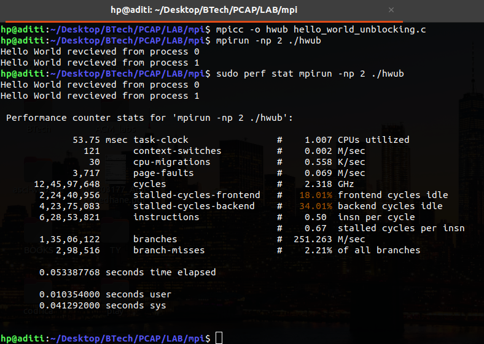
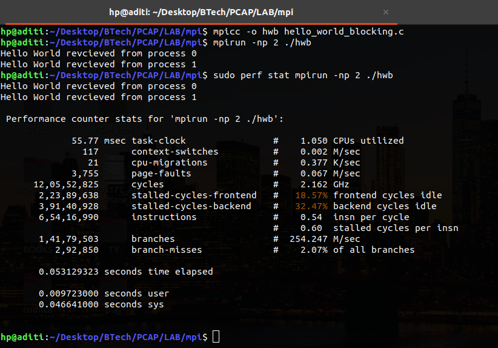
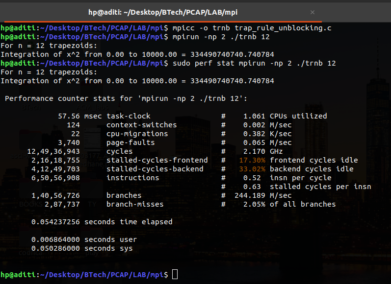
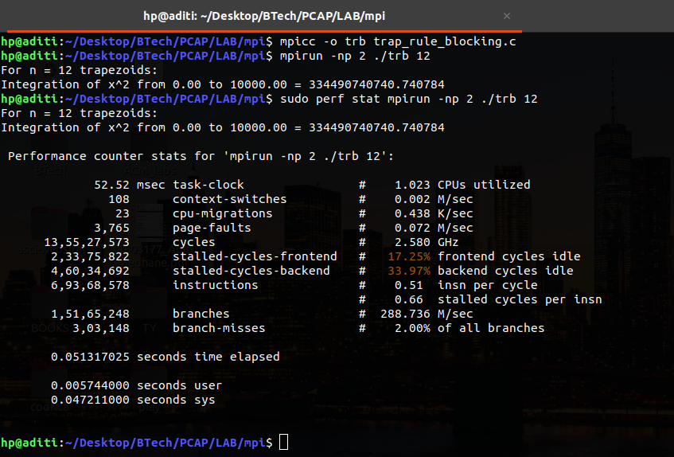
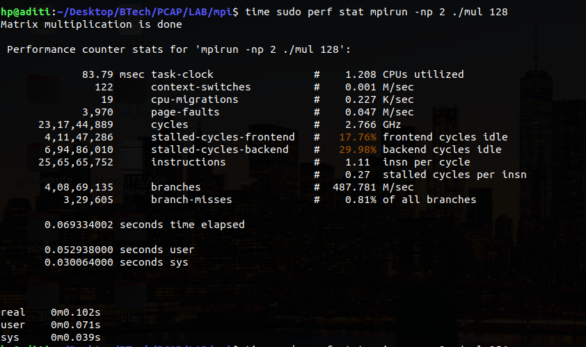
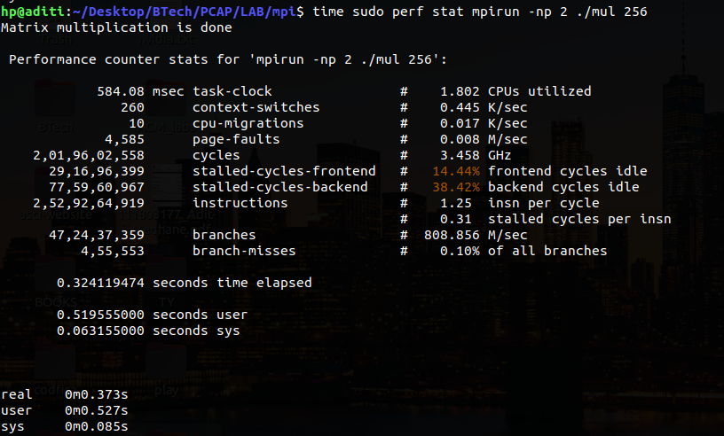
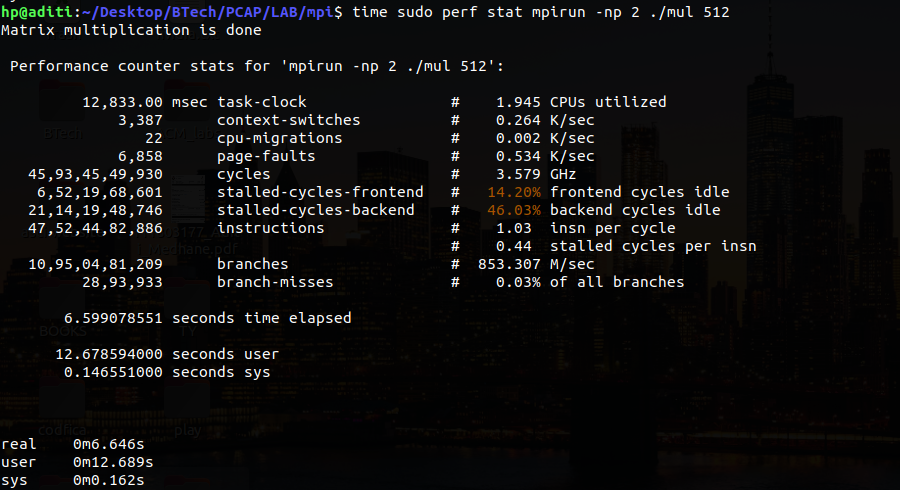
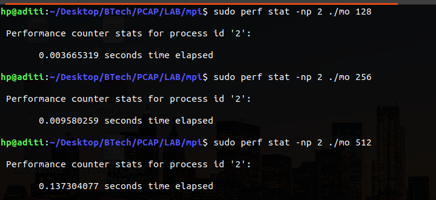

                                                                                                                                                                                                                                                                     
---                                                                                    
title: "PCAP : Demonstration of MPI & openmp programs"
author: Aditi Rajendra Medhane 111803177
---

## 1 : Hello World Non-blocking

## Code

\small
```{.c .numberLines startFrom="1"}
#include <stdio.h>
#include <mpi.h>
#include <math.h>
#include <string.h>

int main(int argc, char* argv) {
	MPI_Status status;
	int num;
	
	MPI_Request request;
	//Initialize MPI computation
	MPI_Init(NULL, NULL);
	//Determine a process's ID number
	MPI_Comm_rank(MPI_COMM_WORLD, &num);
	
	double d = 100.0;
	char arr[] = "Hello World";
	
	int tag = 1;
	
	if(num == 0) {
		MPI_Isend(arr, strlen(arr)+1, MPI_BYTE, 1, tag, MPI_COMM_WORLD, &request);
		MPI_Irecv(arr, strlen(arr)+1, MPI_BYTE, 1, tag, MPI_COMM_WORLD, &request);
		MPI_Wait(&request, &status);
		printf("%s revcieved from process %d\n", arr, num);
	}
	else {
		MPI_Isend(arr, strlen(arr)+1, MPI_BYTE, 0, tag, MPI_COMM_WORLD, &request);
		MPI_Irecv(arr, strlen(arr)+1, MPI_BYTE, 0, tag, MPI_COMM_WORLD, &request);
		MPI_Wait(&request, &status);
		printf("%s revcieved from process %d\n", arr, num);
	}
	
	MPI_Finalize();
	return 0;
}
```

### Output



\pagebreak

## 2 : Hello World blocking

## Code

\small
```{.c .numberLines startFrom="1"}
#include <stdio.h>
#include <mpi.h>
#include <math.h>
#include <string.h>

int main(int argc, char* argv) {
	MPI_Status status;
	int num;
	
	//Initialize MPI computation
	MPI_Init(NULL, NULL);
	//Determine a process's ID number
	MPI_Comm_rank(MPI_COMM_WORLD, &num);
	
	double d = 100.0;
	char arr[] = "Hello World";
	
	int tag = 1;
	
	if(num == 0) {
		MPI_Send(arr, strlen(arr)+1, MPI_BYTE, 1, tag, MPI_COMM_WORLD);
		MPI_Recv(arr, strlen(arr)+1, MPI_BYTE, 1, tag, MPI_COMM_WORLD, &status);
		printf("%s revcieved from process %d\n", arr, num);
	}
	else {
		MPI_Send(arr, strlen(arr)+1, MPI_BYTE, 0, tag, MPI_COMM_WORLD);
		MPI_Recv(arr, strlen(arr)+1, MPI_BYTE, 0, tag, MPI_COMM_WORLD, &status);
		printf("%s revcieved from process %d\n", arr, num);
	}
	
	MPI_Finalize();
	return 0;
}
```

### Output



\pagebreak

## 3 : Trapezium rule Non-blocking
Implements the trapezoidal rule for numerical integration.
To approximate the area between the graph of a function, y = f(x), two vertical lines, and the x-axis.

## Explanation
Steps cosidered while parallelizing code :
1. Partition the problem solution into tasks.
2. Identify the communication channels between the tasks.
3. Aggregate the tasks into composite tasks.
4. Map the composite tasks to cores.

For the trapezoidal rule, two types of tasks will need to consider : 
1. finding the area of a single trapezoid.
2. computing the sum of these areas. 
Then the communication channels will join each of the tasks of the first type to the single task of the second type. 

## Code

\small
```{.c .numberLines startFrom="1"}
#include <stdio.h>
#include <stdlib.h>
#include <string.h>
#include <mpi.h>

const double a = 0;
const double b = 10000;

double trapezoid_area(double left_endpt, double right_endpt, int trap_count, double base_len);
double F(double x);


int main(int argc, char** argv) {
	int rank, size, n_trapezoids, n;
	double x0, x1, h, process_integral, final_integral;
	int source;
	
	MPI_Request request;
	MPI_Init(NULL, NULL);
	MPI_Comm_rank(MPI_COMM_WORLD, &rank);
	MPI_Comm_size(MPI_COMM_WORLD, &size);
	
	if (argc!= 2){
		printf("Enter the command as : mpirun -np <N> %s <number of trapezoids> \n", argv[0]);
		n_trapezoids = -1;
		MPI_Finalize();
		exit(-1);
	} 
	else {
		n_trapezoids = atoi(argv[1]);
	}
	MPI_Bcast(&n_trapezoids, 1, MPI_DOUBLE, 0, MPI_COMM_WORLD);
	
	//For every process, h and n will be same
	h = (b-a)/n_trapezoids;
	n = n_trapezoids/size;
	
	//For calculating the interval of integration for each process
	x0 = a + rank * n * h;
	x1 = x0 + n * h;
	
	MPI_Barrier(MPI_COMM_WORLD);
	
	//calculate integral of each process
	process_integral = trapezoid_area(x0, x1, n, h);
	
	if (rank != 0) {
		MPI_Isend(&process_integral, 1, MPI_DOUBLE, 0, 0, MPI_COMM_WORLD, &request); 
	}
	else {
		final_integral = process_integral;
	      	for (source = 1; source < size; source++) {
			MPI_Status status;
		 	MPI_Irecv(&process_integral, 1, MPI_DOUBLE, source, 0, MPI_COMM_WORLD, &request);
		 	MPI_Wait(&request, &status);
			final_integral += process_integral;
	      	}
	      
	      	printf("For n = %d trapezoids:\n", n_trapezoids);
	     	printf("Integration of x^2 from %0.2f to %0.2f = %f\n", a, b, final_integral);
	}
	
	MPI_Finalize();

	return 0;

}	
	
double F(double x) {
	return x * x;
}
	
double trapezoid_area(double left_endpt, double right_endpt, int trapezoid_count, double base_len) {
	double integral, x;
	int i;
	
	integral = (F(left_endpt) + F(right_endpt))/2.0;
	for (i = 1; i <= trapezoid_count-1; i++) {
		x = left_endpt + i * base_len;
		integral += F(x);
	}
	integral = integral * base_len;

	return integral;
}				
```
 
### Output



\pagebreak

## 4 : Trapezium rule blocking

## Code

\small
```{.c .numberLines startFrom="1"}
#include <stdio.h>
#include <stdlib.h>
#include <string.h>
#include <mpi.h>

const double a = 0;
const double b = 10000;

double trapezoid_area(double left_endpt, double right_endpt, int trap_count, double base_len);
double F(double x);


int main(int argc, char** argv) {
	int rank, size, n_trapezoids, n;
	double x0, x1, h, process_integral, final_integral;
	int source;
	
	MPI_Init(NULL, NULL);
	MPI_Comm_rank(MPI_COMM_WORLD, &rank);
	MPI_Comm_size(MPI_COMM_WORLD, &size);
	
	if (argc!= 2){
		printf("Enter the command as : mpirun -np <N> %s <number of trapezoids> \n", argv[0]);
		n_trapezoids = -1;
		MPI_Finalize();
		exit(-1);
	} 
	else {
		n_trapezoids = atoi(argv[1]);
	}
	MPI_Bcast(&n_trapezoids, 1, MPI_DOUBLE, 0, MPI_COMM_WORLD);
	
	//For every process, h and n will be same
	h = (b-a)/n_trapezoids;
	n = n_trapezoids/size;
	
	//For calculating the interval of integration for each process
	x0 = a + rank * n * h;
	x1 = x0 + n * h;
	
	MPI_Barrier(MPI_COMM_WORLD);
	
	//calculate integral of each process
	process_integral = trapezoid_area(x0, x1, n, h);
	
	if (rank != 0) {
		MPI_Send(&process_integral, 1, MPI_DOUBLE, 0, 0, MPI_COMM_WORLD);
	}
	else {
		final_integral = process_integral;
	      	for (source = 1; source < size; source++) {
			MPI_Status status;
		 	MPI_Recv(&process_integral, 1, MPI_DOUBLE, source, 0, MPI_COMM_WORLD, &status);
			final_integral += process_integral;
	      	}
	      
	      	printf("For n = %d trapezoids:\n", n_trapezoids);
	     	printf("Integration of x^2 from %0.2f to %0.2f = %f\n", a, b, final_integral);
	}
	
	MPI_Finalize();

	return 0;

}	
	
double F(double x) {
	return x * x;
}
	
double trapezoid_area(double left_endpt, double right_endpt, int trapezoid_count, double base_len) {
	double integral, x;
	int i;
	
	integral = (F(left_endpt) + F(right_endpt))/2.0;
	for (i = 1; i <= trapezoid_count-1; i++) {
		x = left_endpt + i * base_len;
		integral += F(x);
	}
	integral = integral * base_len;

	return integral;
}			                                                                                                                                                                                                                                                                                                                           
```

### Output



\pagebreak

## 5 : Matrix Multiplication using MPI 

## Code

\small
```{.c .numberLines startFrom="1"}
#include <stdio.h>
#include <mpi.h>
#include <math.h>
#include<unistd.h>
#include<stdlib.h>

MPI_Status status;


int main(int argc, char **argv)  {
	int rank, size;
	
	MPI_Init(&argc, &argv);
	MPI_Comm_rank(MPI_COMM_WORLD, &rank);
	MPI_Comm_size(MPI_COMM_WORLD, &size);
	
	if(argc < 2) {
		printf("Enter the correct arguments\n");
		return 1;
	}
	
	int N = atoi(argv[1]);
	
	double a[N][N],b[N][N],c[N][N];

	
	int workers, rows, offset, dest, source, r1=N, c1=N,i,j,k;
	
	if(rank == 0)  {
		for (i = 0; i < r1; i++) {
			for (j = 0; j < c1; j++) {
				a[i][j] = rand() % 10;
				b[i][j] = rand() % 10;
			}
		}
		
		workers = size - 1;

		
		rows = N/workers;
		offset = 0;
		
		for(dest = 1; dest <= workers; dest++) {
			MPI_Send(&offset, 1, MPI_INT, dest, 1, MPI_COMM_WORLD);
			MPI_Send(&rows, 1, MPI_INT, dest, 1, MPI_COMM_WORLD);
			MPI_Send(&a[offset][0], rows*N, MPI_DOUBLE,dest,1, MPI_COMM_WORLD);
			MPI_Send(&b, N*N, MPI_DOUBLE, dest, 1, MPI_COMM_WORLD);
			offset = offset + rows;
		}
		
		for (i=1; i<=workers; i++) {
			source = i;
			MPI_Recv(&offset, 1, MPI_INT, source, 2, MPI_COMM_WORLD, &status);
			MPI_Recv(&rows, 1, MPI_INT, source, 2, MPI_COMM_WORLD, &status);
			MPI_Recv(&c[offset][0], rows*N, MPI_DOUBLE, source, 2, MPI_COMM_WORLD, &status);
		}
		
		
		printf("Matrix multiplication is done\n");
		/*
		for (i=0; i<N; i++) {
			for (j=0; j<N; j++)
				printf("%6.2f   ", c[i][j]);
			printf ("\n");
		}
		*/
	}
	
	if (rank > 0) {
		source = 0;
		MPI_Recv(&offset, 1, MPI_INT, source, 1, MPI_COMM_WORLD, &status);
		MPI_Recv(&rows, 1, MPI_INT, source, 1, MPI_COMM_WORLD, &status);
		MPI_Recv(&a, rows*N, MPI_DOUBLE, source, 1, MPI_COMM_WORLD, &status);
		MPI_Recv(&b, N*N, MPI_DOUBLE, source, 1, MPI_COMM_WORLD, &status);
		
		for (k=0; k<N; k++) {
			for (i=0; i<rows; i++) {
				c[i][k] = 0.0;
				for (j=0; j<N; j++)
			  		c[i][k] = c[i][k] + a[i][j] * b[j][k];
		      	}
		}

		MPI_Send(&offset, 1, MPI_INT, 0, 2, MPI_COMM_WORLD);
		MPI_Send(&rows, 1, MPI_INT, 0, 2, MPI_COMM_WORLD);
		MPI_Send(&c, rows*N, MPI_DOUBLE, 0, 2, MPI_COMM_WORLD);
		
	}
	
	MPI_Finalize();
	return 0;
}	
```

## Conclusion

Size 	|  Time Elapsed(MPI)    | 	CPU Utilization(MPI)	| 

128	  0.069979909 seconds		1.208 CPUs utilized 

256	  0.324119474 seconds		1.802 CPUs utilized

512	  6.599078551 seconds		1.945 CPUs utilized	

### Output





\pagebreak

## 6 : Matrix Multiplication using openmp 

## Code

\small
```{.c .numberLines startFrom="1"}
#include <stdio.h>
#include <stdlib.h>
#include <unistd.h>
#include <omp.h>

#define THREADS 16

int main(int argc, char **argv) {
    // Initialize the matrices
    int SIZE = atoi(argv[1]);
    
    int matrix_a[SIZE][SIZE];
    int matrix_b[SIZE][SIZE];
    int matrix_c[SIZE][SIZE];
    
    for(int i = 0; i < SIZE; i++) {
        for(int j = 0; j < SIZE; j++) {
            matrix_a[i][j] = rand() % 10;
            matrix_b[i][j] = rand() % 10;
            matrix_c[i][j] = 0;
        }
    }
    
    omp_set_num_threads(THREADS);
    #pragma omp parallel
    {
        int id = omp_get_thread_num();
        #pragma omp for
            for(int i = id*(SIZE/THREADS); i < (id + 1)*(SIZE/THREADS); i++) {
                for(int c = 0; c < SIZE; c++) {
                    matrix_c[i][c] = 0;
                    for(int k = 0; k < SIZE; k++) {
                        matrix_c[i][c] += matrix_a[i][k]*matrix_b[k][c];
                    }
                }
            }
    }

    return 0;
}
```

## Observation

Size	| Time Elapsed
128	  0.003665319 seconds

256	  0.009580259 seconds

512	  0.137304077 seconds	

### Output



## Conclusion

MPI    => Internodes
Openmp => Intranodes

MPI    : Runtime decreases as the numeber of core increases, upto a limit where there is not much improvement.

Openmp : Using, more threads decreases the run time, the desired result, but for small matrix sizes
	 using more number of threads slow down the calculation.


