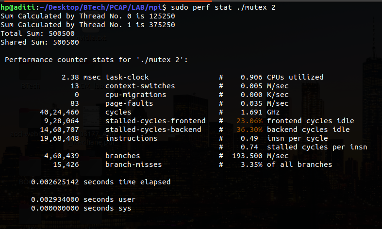
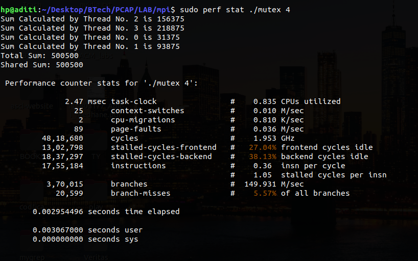
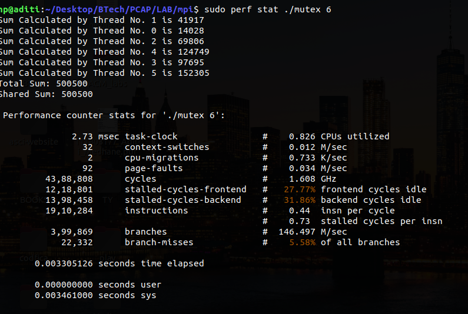
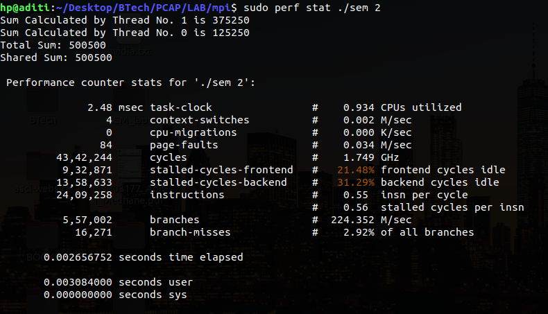
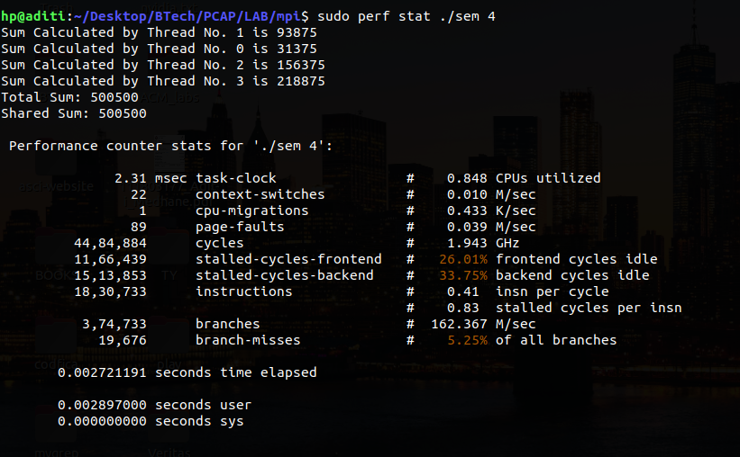
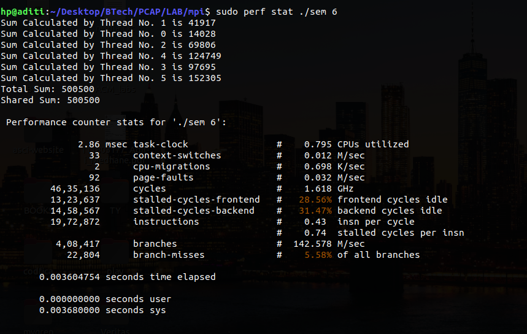

---                                                                                    
title: "PCAP : Demonstration of openmp semaphore & mutex programs"
author: Aditi Rajendra Medhane 111803177
---

## 1 :openmp Mutex

## Code

\small
```{.c .numberLines startFrom="1"}
#include <stdio.h>
#include <stdlib.h>
#include <omp.h>

int main(int argc, char** argv){

    if(argc < 2) {
        printf("Enter the correct arguments\n");
        return 1;
    }
    int threads = atoi(argv[1]);
    omp_set_num_threads(threads);
    
    int partial_Sum, total_Sum = 0, shared_sum = 0;
    omp_lock_t writelock;
    omp_init_lock(&writelock);
    
    #pragma omp parallel private(partial_Sum) shared(total_Sum, shared_sum)
    {
        partial_Sum = 0;

        #pragma omp for
        for(int i = 1; i <= 1000; i++){
            partial_Sum += i;
            omp_set_lock(&writelock);
            shared_sum += i;
            omp_unset_lock(&writelock);
        }
        
        #pragma omp critical
        {
            printf("Sum Calculated by Thread No. %d is %d\n", omp_get_thread_num(), partial_Sum);
            total_Sum += partial_Sum;
        }
    }
    omp_destroy_lock(&writelock);
    printf("Total Sum: %d\n", total_Sum);
    printf("Shared Sum: %d\n", shared_sum);
    return 0;
}
```

### Output





\pagebreak

## 1 :openmp Semaphores

## Code

\small
```{.c .numberLines startFrom="1"}
#include <stdio.h>
#include <stdlib.h>
#include <semaphore.h>
#include <omp.h>

int main(int argc, char** argv){

    if(argc < 2) {
        printf("Enter the correct arguments\n");
        return 1;
    }
    int threads = atoi(argv[1]);
    omp_set_num_threads(threads);
    
    int partial_Sum, total_Sum = 0, shared_sum = 0;
    sem_t semaphore;
    sem_init(&semaphore, 0, 1);
    
    #pragma omp parallel private(partial_Sum) shared(total_Sum, shared_sum)
    {
        partial_Sum = 0;

        #pragma omp for
        for(int i = 1; i <= 1000; i++){
            partial_Sum += i;
            sem_wait(&semaphore);
            shared_sum += i;
            sem_post(&semaphore);
        }
        
        #pragma omp critical
        {
            printf("Sum Calculated by Thread No. %d is %d\n", omp_get_thread_num(), partial_Sum);
            total_Sum += partial_Sum;
        }
    }
    sem_destroy(&semaphore);
    printf("Total Sum: %d\n", total_Sum);
    printf("Shared Sum: %d\n", shared_sum);
    return 0;
}
```

### Output





\pagebreak
